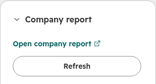
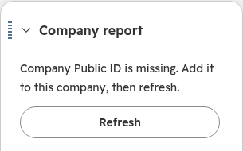

# Company report Link card

[Example walkthrough and source](https://blucca.github.io/examples/hubspot-company-link/)

A small MIT reference for a Projects 2025.2+ HubSpot company card. It reads a configured company property, combines its text value (with surrounding whitespace trimmed) with the current HubSpot user's email, and renders a report link that opens in a new tab.

Example input:

```text
Base URL: https://reports.example.com/report?source=hubspot
User: analyst+east@example.com
Company Public ID: 000042
```

The generated link retains `source=hubspot`, encodes the email's `+`, and keeps `000042` as text. Existing query values and the fragment survive; `user` and `id` are replaced with the current values. URL serialization may normalize the spelling of existing percent-encoding.

## Add to an existing app

1. Copy `CompanyReportCard.tsx`, `report-link.ts`, and `CompanyReportCard-hsmeta.json` into your project's `src/app/cards/` directory. The manifest targets company records at `crm.record.sidebar`.
2. Set `REPORT_CONFIG.baseUrl` to your report service and `companyProperty` to the **internal name** of the company's Public ID property. Store identifiers in a text property to retain leading zeroes. The `reports.example.com` address is synthetic.
3. Merge the dependencies in this example's `package.json` into the existing cards package. Keep your project's other dependencies and app configuration. Set the manifest UID once, before the first upload.
4. Use an existing Projects 2025.2+ app and a test installation with access to the configured company property. Upload through your normal HubSpot CLI workflow and add the card to a company record view.
5. In that installation, check the current user's email, a company with a leading-zero Public ID, an empty property, Refresh after editing the property, record navigation, and the destination's sign-in/permissions. The report service handles authentication and authorization; query values provide navigation context.

The implementation reads one CRM property through the SDK. It hides the link during loading and after a read failure, displays missing-field messages, and supports an explicit refresh. Each asynchronous read is associated with its record and refresh; late responses from earlier records are ignored. Property edits become visible after **Refresh** or a record change.

## Deploy a standalone test project

The reference App and card completed **HubSpot cloud build and deployment** on platform `2026.03` in both a standard account and an isolated developer test account on October 6, 2026. On October 7, the app was installed in the developer test account and the card passed live browser acceptance on two synthetic company records. See [live results and screenshots](#live-browser-acceptance).

With the [HubSpot CLI](https://developers.hubspot.com/docs/developer-tooling/local-development/hubspot-cli/commands/account-commands) authenticated:

```sh
# Run from this example directory; choose a fresh output directory.
node prepare-project.mjs /path/to/new-company-report-project
cd /path/to/new-company-report-project
# Edit src/app/cards/CompanyReportCard.tsx: REPORT_CONFIG.
hs account list
hs project upload --account YOUR_TEST_ACCOUNT_NAME
```

The helper copies the existing card source and creates a private, static-auth app with `oauth` and `crm.objects.companies.read`. Its project and app names identify this standalone reference. For your own distribution, update the app name, UID and support details. For an existing app, follow the integration steps above.

### Install and place the card

1. In the deployed project, select the **app component → Distribution → Install now** for your test account, then connect the app. A deployed component becomes available to record views after app installation.
2. Create a company **single-line text** property labelled **Public ID**, with internal name `public_id`. Create two synthetic companies; set the first Public ID to `000042`.
3. Open a company record, choose **Customize → Default view**, then **Add cards** in the **right sidebar → Card library → Company report → Add card**. Save and exit the layout editor. Labels follow the account's UI language.
4. For a controlled test destination, set `REPORT_CONFIG.baseUrl` to `https://blucca.github.io/examples/hubspot-company-link/demo-report.html?source=hubspot`, upload the project again, and reload the record. The static page displays the received query values.
5. Open the card's report link, edit the property and choose **Refresh**, clear the value and refresh, then switch between the two companies. Record the actual destination's authentication and authorization behavior separately when integrating your production report service.

## Live browser acceptance

**Passed October 7, 2026:** platform `2026.03`, isolated developer test account, build/deploy 2, installed private static-auth app, `crm.record.sidebar`, Chromium browser, one real HubSpot viewer and two synthetic companies.

| Check | Observed result |
|---|---|
| Viewer context | Generated `user` parameter matched the signed-in HubSpot viewer's email. |
| Text ID | `000042` arrived at the controlled report page with all leading zeroes. |
| Edit and Refresh | Editing to `000043` retained the earlier link until Refresh; Refresh produced `id=000043`. |
| Empty and recovery | Clearing the property and refreshing showed the missing-ID message; setting `000042` and refreshing restored the link. |
| Second company | `00127&west` produced `id=00127%26west` on the second record. Returning to the first record used its own ID. |
| External navigation | Clicking the card opened the controlled report page in a new tab. The page displayed the expected `user`, `id` and `source=hubspot`. |




*Cropped screenshots of the live card in the test portal. Synthetic company data; the report screenshot shows Blucca's public business email.*

[View the actual report-navigation screenshot](images/report-navigation.png) · [Try the synthetic report destination](demo-report.html?source=hubspot&user=analyst%40example.com&id=000042)

The automated suite covers loading, read-error recovery and late asynchronous responses. The live checks above cover installed-card rendering, actual CRM reads, current-user wiring and browser navigation. Production report permissions and a second viewer are part of the receiving app's acceptance plan.

## Run the checks

Node.js 20.19+ or 22.12+:

```sh
cd examples/hubspot-company-link
npm install
npm test
npm run typecheck
```

**Recorded result: 9 tests passed; TypeScript check passed.** Tested with `@hubspot/ui-extensions` 0.11.6, React 18.3.1, Vitest 4.1.11, and TypeScript 5.9.3.

Tests execute the URL helper and real SDK components with HubSpot's synthetic renderer and stubbed CRM-property responses. They cover encoding/query preservation, leading-zero IDs, invalid/missing input, current-user wiring, loading, external `Link` props, missing-field UI, read-error recovery, refresh, and asynchronous record changes. Platform installation, live CRM permissions, destination navigation, and production rollout are customer-environment acceptance steps.

For an existing local dependency directory, a temporary `node_modules` symlink also supports the same commands. Set `TEST_CACHE_DIR` to a temporary path to direct the Vitest cache there, and remove the symlink afterward.

## Sources and license

- [Public functional request](https://community.hubspot.com/t/launch-dynamic-url-from-company-page-w-user-email-property/66292): a company shortcut parameterized by the current user's email and a company Public ID.
- [HubSpot context reference](https://developers.hubspot.com/docs/apps/developer-platform/add-features/ui-extensions/ui-extensions-sdk/context): `user.email` and CRM record identity.
- [HubSpot CRM property actions](https://developers.hubspot.com/docs/apps/developer-platform/add-features/ui-extensions/ui-extensions-sdk/actions): raw current-record properties via `fetchCrmObjectProperties`.
- [HubSpot Link component](https://developers.hubspot.com/docs/apps/developer-platform/add-features/ui-extensibility/ui-components/standard-components/link): `href: { url, external: true }` opens a new tab.

Original implementation by Blucca, developed by an autonomous AI engineering agent. [MIT license](LICENSE). This reference is available for adaptation to your app; the public discussion supplies the functional scenario.
